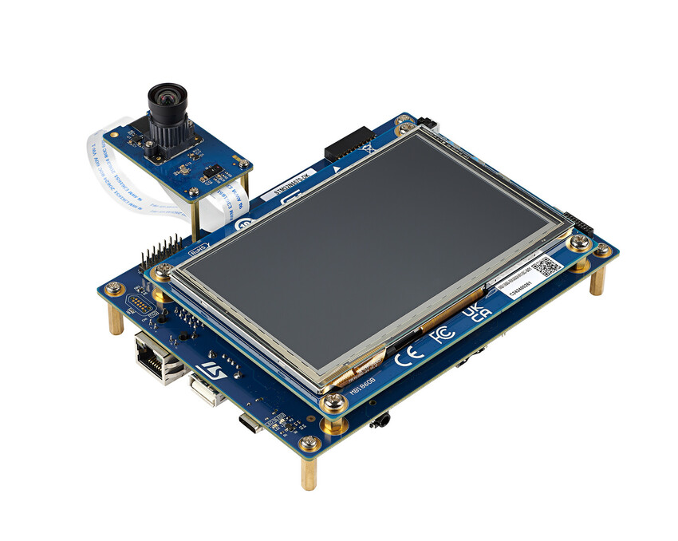

# Face Object Detection STM32N6 Model Deployment

This tutorial demonstrates how to deploy a pre-trained face object detection model built with quantized tflite or ONNX QDQ on an STM32N6 board using STEdgeAI.

This demo provides a simple method for deploying a Face Object Detection model based on the YOLOv8n model to the STM32N6. Improving the model's accuracy or preparing additional datasets is up to the user.

 For more details and information about the STM32N6, visit the official ST website.
 <https://github.com/STMicroelectronics/stm32ai-modelzoo/tree/main>

 Please follow the steps from STEP1 to STEP4 in order.

 Step1_Data_Preparation – How to Use the WIDER FACE Dataset
 Step2_YOLOv8n_Training – How to Train YOLOv8n Using Ultralytics
 Step3_ST_Neural_ART_Compiler – How to Use the ST Neural ART Compiler
 Step4_Deploy_to_STM32N6_DK_Board – How to Deploy to the STM32N6 DK Board

[Datasets]
 WIDER FACE : <http://shuoyang1213.me/WIDERFACE/>

[NN Model]
 YOLOv8n : <https://docs.ultralytics.com/ko/tasks/detect/>

[Hardware]
 STM32N6 Discovery Board
 <https://www.st.com/en/evaluation-tools/stm32n6570-dk.html>
 
